# FoDiMoCo - Ford display module (FDIM) controller [](https://travis-ci.org/p1ne/fdim-controller)


## What's this all about

Long story short. FoDiMoCo is easy-to-build DIY controller for your Ford USA vehicle that
enables top dash display to display some useful information when stock head unit is removed.
Initial name of the project was can-clock, as all I wanted to do it to print clock on dash display. Later it evolved, but name is still in the code.

This README is yet unfinished, nearest plans are to give more details on configuration and finalize messages description.

If you're too far away from the subject, there is introductory [presentation](presentation) I made on one of DIY meetups

Table of Contents
=================

  * [Overview](#overview)
    * [Functionality](#functionality)
    * [Hardware options](#hardware-options)
    * [Plugging into your vehicle options](#plugging-into-your-vehicle-options)
  * [Hardware](#hardware)
    * [Parts list](#parts-list)
    * [Schematics](#schematics)
    * [PCB](#pcb)
    * [Soldering step\-by\-step](#soldering-step-by-step)
    * [Plugging into car](#plugging-into-car)
      * [Behind FDIM](#behind-fdim)
      * [Into OBD](#into-obd)
      * [With separate ACC power wire](#with-separate-acc-power-wire)
  * [CAN bus structure](#can-bus-structure)
    * [Ford CAN buses: MS CAN and HS CAN](#ford-can-buses-ms-can-and-hs-can)
    * [Messages for FDIM](#messages-for-fdim)
      * [0x50c \- heartbeat](#0x50c---heartbeat)
      * [0x3e8 \- top line of FDIM module and heartbeat](#0x3e8---top-line-of-fdim-module-and-heartbeat)
      * [0x3ef \- unknown](#0x3ef---unknown)
      * [0x3f2 \- clock](#0x3f2---clock)
      * [0x3f1 \- unknown](#0x3f1---unknown)
      * [0x324 \- text message](#0x324---text-message)
      * [0x336 \- text message](#0x336---text-message)
      * [0x337 \- text message](#0x337---text-message)
      * [0x726 \- TPMS request](#0x726---tpms-request)
      * [0x72e \- TPMS response](#0x72e---tpms-response)
      * [0x3b5 \- TPMS broadcast](#0x3b5---tpms-broadcast)
      * [0x423 \- Speed, RPM, on/off status](#0x423---speed-rpm-onoff-status)
      * [0x466 \- GPS time data](#0x466---gps-time-data)
    * [Message sequences](#message-sequences)
      * [Initialization](#initialization)
      * [Heartbeat](#heartbeat)
      * [Text output](#text-output)
      * [TPMS request](#tpms-request)
  * [Software](#software)
    * [Source code structure](#source-code-structure)
    * [Flashing from Arduino IDE](#flashing-from-arduino-ide)
    * [Flashing from Platform IO/Atom](#flashing-from-platform-ioatom)
    * [Flashing pre\-built firmwares](#flashing-pre-built-firmwares)
      * [On Windows](#on-windows)
      * [On Mac](#on-mac)
      * [On Linux](#on-linux)
  * [Configuration](#configuration)
    * [Serial communication setup](#serial-communication-setup)
    * [Options](#options)

## Overview

When this controller is plugged in, your dash display looks like that


Module itself looks like that (one of hardware variants)

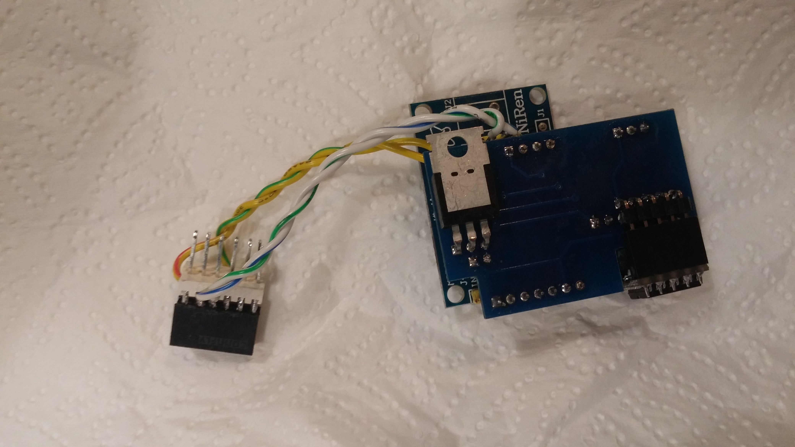

FoDiMoCo is tested on Ford Escapes (including Hybrid) and Mercury Mariners 2008-2012.
Should work on other Fords of the same generation, including Mustang, Fiesta, F-150,
but it's not yet verified due to lack of test vehicles.

FoDiMoCo is built on Arduino and components that could be found on AliExpress and/or your local
DIY electronics store, so it should be easy to reproduce. PCB is available for order at Dirt Cheap PCBs.

If you don't want to read this long text, there are steps you need to build your own FoDiMoCo:

1. [Buy parts](#parts-list)
2. [Order or make PCB](#pcb)
3. [Solder](#soldering-step-by-step)
4. [Flash](#flashing-pre-built-firmwares)
5. [Configure](#configuration)
6. [Plug into the car](#plugging-into-car)

### Functionality

- display current speed, RPM, engine temperature, tires pressure, tires temperature, current time
- configurable display units (km/miles for speed, Celsius/Fahrenheit for temperatures, psi/bars/kPa for pressure, 12h/24h for clock)
- full functionality offered with aftermarket head unit (with no other modules using dash display)
- support for CAN-enabled aftermarket head units (may require minor additional power wiring)
- very early preliminary support for stock head units
- semi-configurable display layout for different head unit types
- configuration made on the fly via serial terminal

### Hardware options

- with internal Real Time Clock module
- no internal Real Time Clock (RTC) module, time is taken directly from your vehicle GPS module (model year 2009 and newer with 911 Assist)

### Plugging into your vehicle options

- directly behind your dash display module using DIY pass-through connector
- into vehicle OBD connector

## Hardware

### Parts list
- <details markdown="1">
    <summary markdown="1">Arduino Pro Micro with non-soldered pins</summary> <p>

    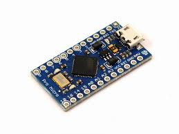

    [Search AliExpress](https://aliexpress.com/wholesale?SearchText=arduino+pro+micro)
    </p>
  </details>
- <details>
    <summary>CAN bus controller (MCP 2515 based)</summary> <p>

    

    [Search AliExpress](https://aliexpress.com/wholesale?SearchText=mcp2515+controller)
    </p>
  </details>
- <details>
    <summary>RTC clock module (DS 3231 based)</summary> <p>

    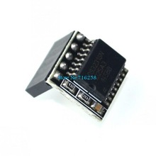

    [Search AliExpress](https://aliexpress.com/wholesale?SearchText=ds3231+raspberry)
    </p>
  </details>
- <details>
    <summary>5 volts voltage regulator</summary> <p>

    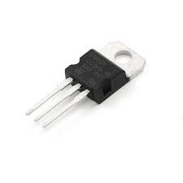

    7805 or similar with wide temperature range and thick heatsink.

    [Search AliExpress](https://aliexpress.com/wholesale?SearchText=7805)
    </p>
    </details>
- <details>
    <summary>Male pin headers straight (2.54mm pitch)</summary> <p>

    

    You will need the following pieces: one 7 pins, one 4 pins, two 3 pins, two 2 pins, one 1 pin

    [Search AliExpress](https://aliexpress.com/wholesale?SearchText=male+pin+headers+straight+2.54)
    </p>
  </details>
- <details>
    <summary>Male pin headers angled (2.54mm pitch)</summary> <p>

    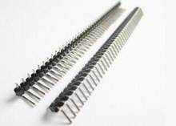

    You will need the following pieces: one 5 pins, one 2 pins

    [Search AliExpress](https://aliexpress.com/wholesale?SearchText=male+pin+headers+angled+2.54)
    </p>
  </details>
- <details>
    <summary>PCB</summary> <p>

    Take [Gerber files](pcb/gerber) and order on [DirtCheap PCB](http://dirtypcbs.com). Or make your own board
    </p>
  </details>

And depending on mount type, choose one of the following options
- <details>
    <summary>ELM327 enclosure</summary> <p>

    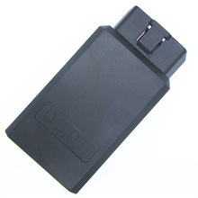

    [Search on AliExpress](https://aliexpress.com/wholesale?SearchText=elm327+enclosure)
    </p>
  </details>
- <details>
    <summary>Long bi-sided pin strips-headers 2x6 (2.54mm pitch), can be cut from 2x7</summary> <p>

    

    Can be cut from 2x7 if no 2x6 are available.

    [Search on AliExpress](https://aliexpress.com/wholesale?SearchText=pin+headers+long+2.54+2x6)
    </p>
  </details>


### Schematics

Schematics are more or less self-explanatory.
Per components:
- ARD1 is for Arduino
- CAN is for CAN controller board
- RTC is optional RTC module
- VREG is voltage regulator to get stabilized 5 volts from in-car voltage
- J_POWER is for in-car voltage (pin 1 +12V, pin 2 GND)
- J_CAN is for in-car MS-CAN bus (pin 1 CAN H, pin 2 CAN L)
- J_RESET is jumper pair to reset Arduino if needed
- J_SERIAL is jumper pair to get serial data (e.g. to print musical tracks)

SPI protocol is used to control CAN interface. SPI CS line is wired to Arduino pin 10. CAN messages received trigger interrupt bound to Arduino pin 7.

I2C protocol is used to interact with Real-Time Clock module.

Voltage regulator is used despite the fact that Arduino Pro Micro can handle power voltage up to 12 volts. Real vehicle voltage with engine running can be up to 14 volts, so usage of separate voltage regulator gives more guarantees.

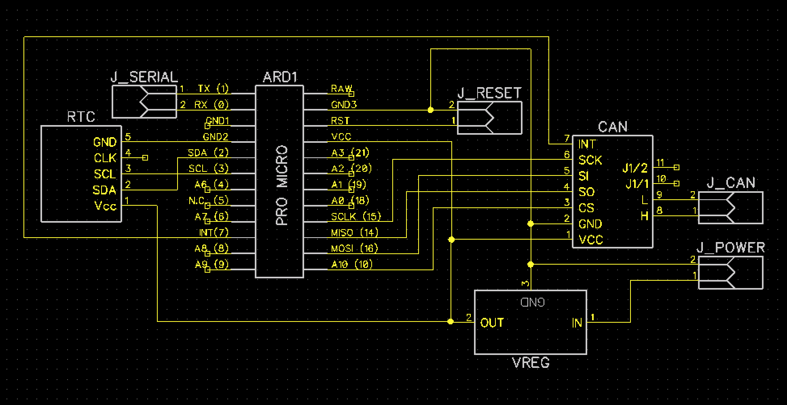

### PCB

PCB is 2-layered with 3 inter-layer drills. DirtCheap PCB make them for you, other manufacturers may require extra wires soldering. Exact components placement is shown below in Soldering section.

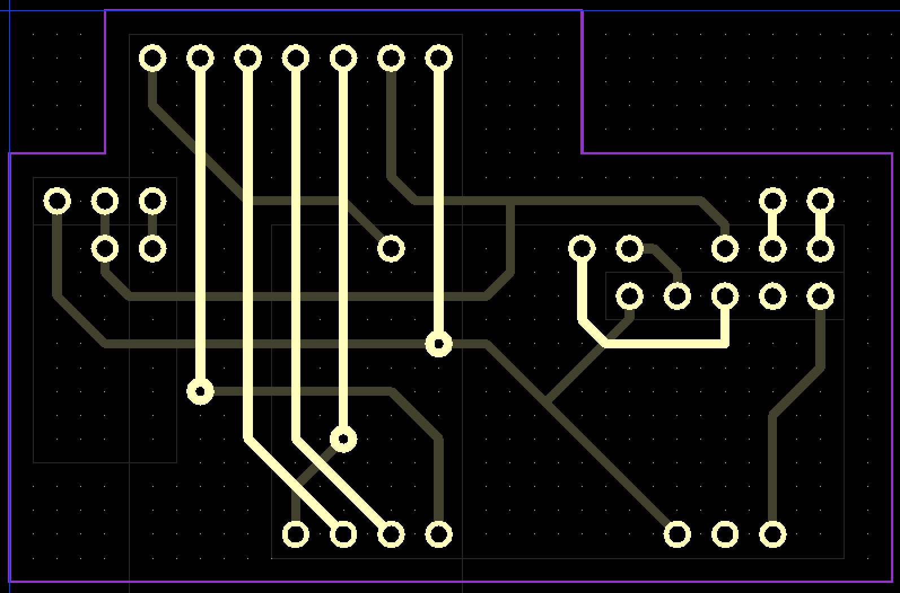

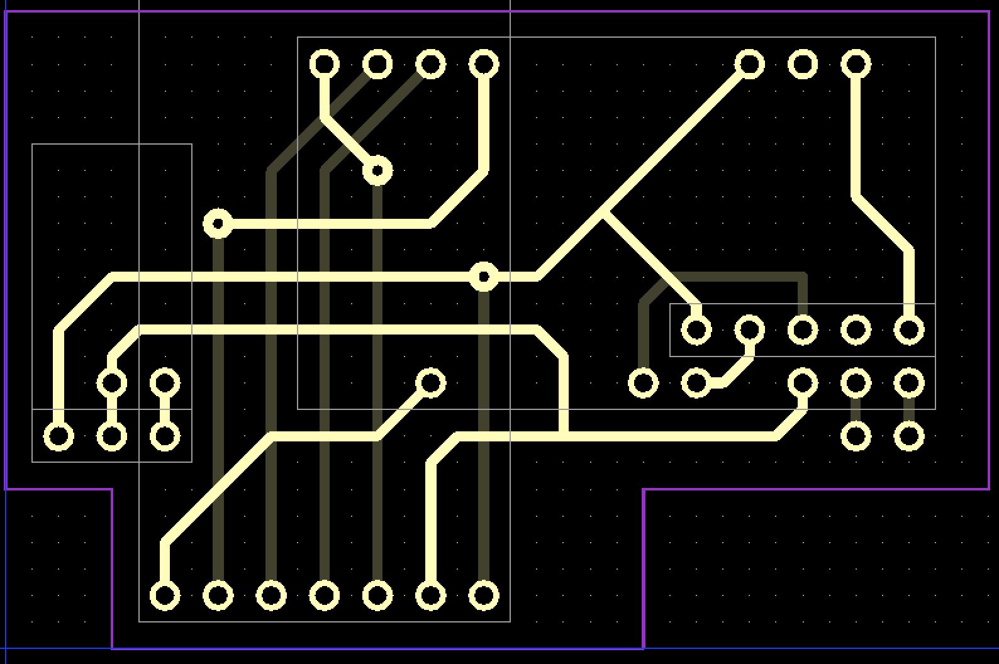

### Soldering step-by-step

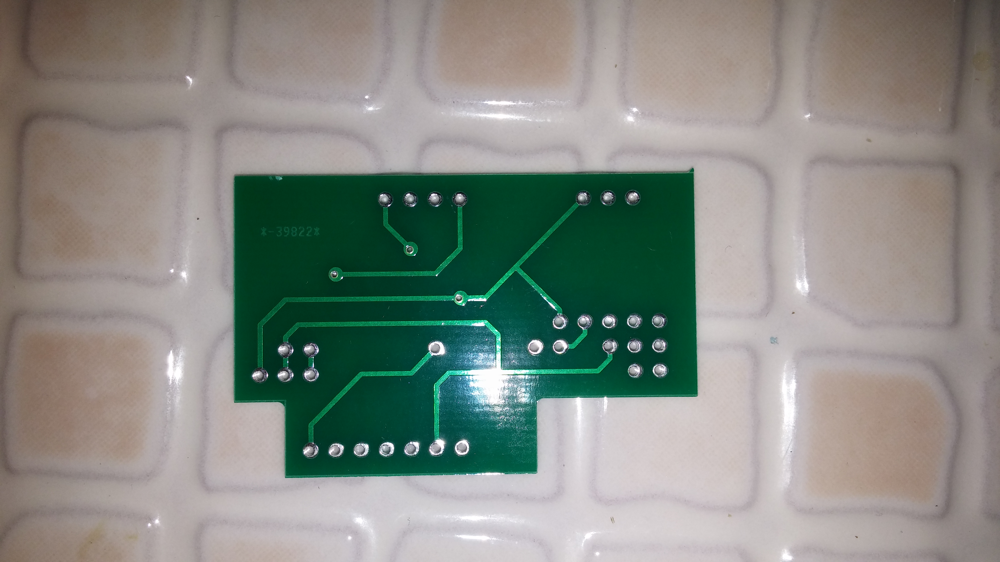

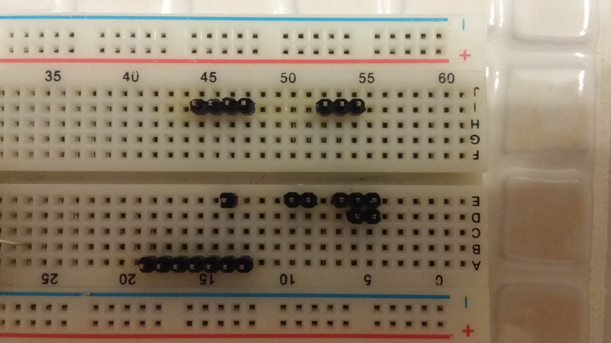

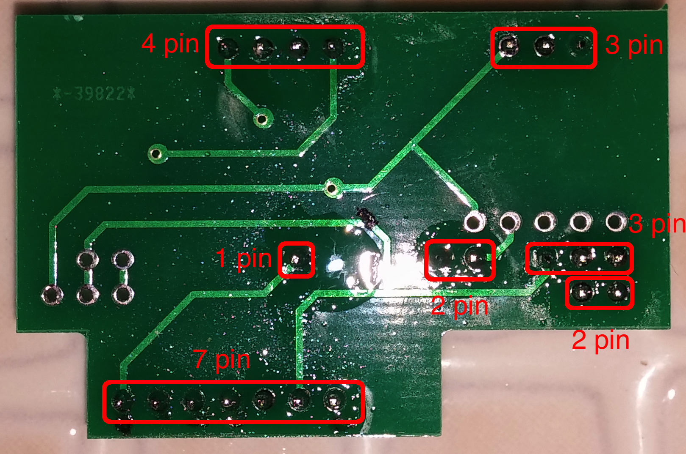

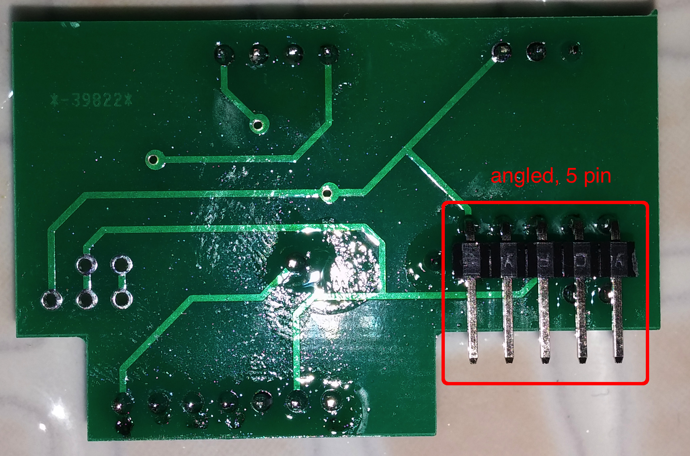

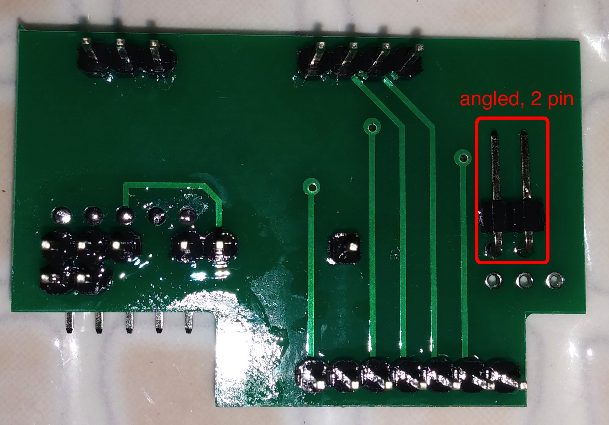

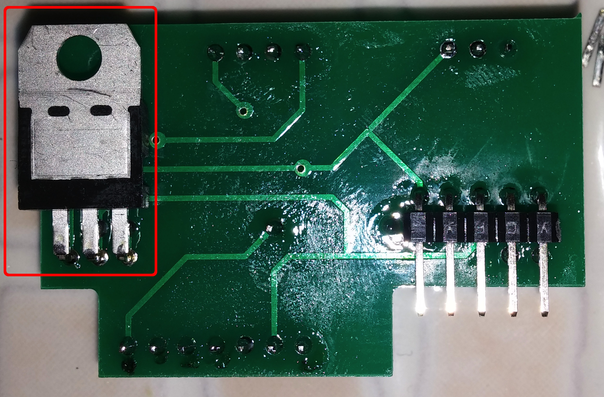

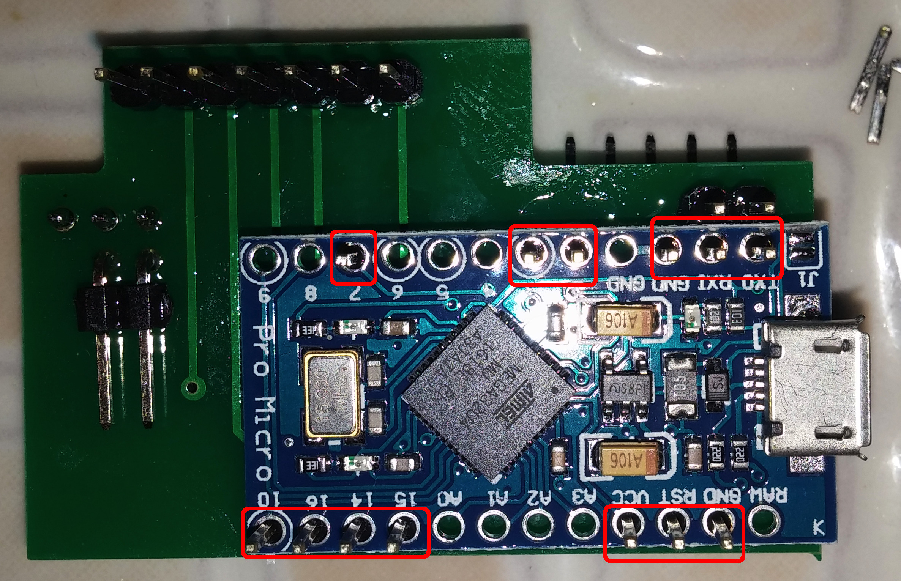

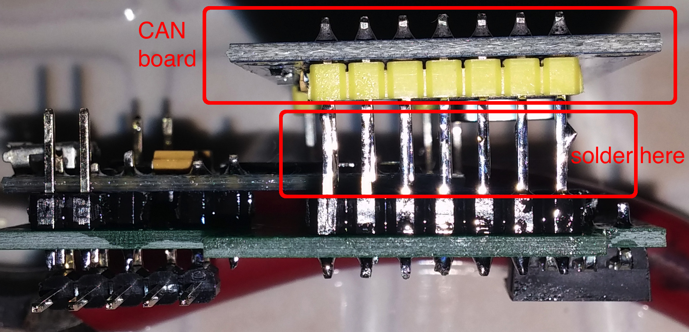

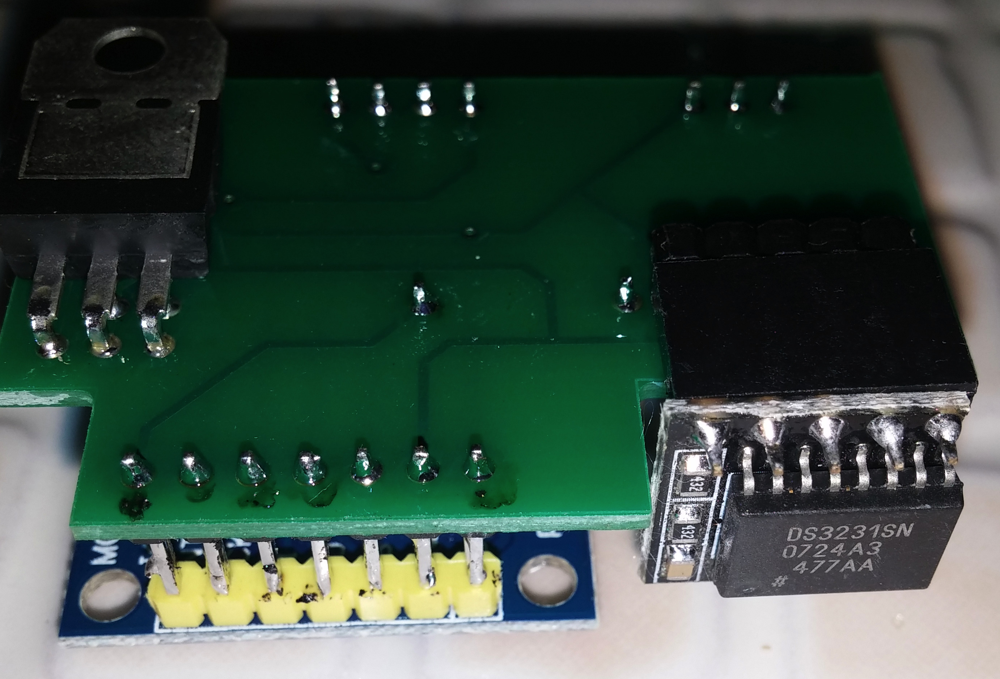

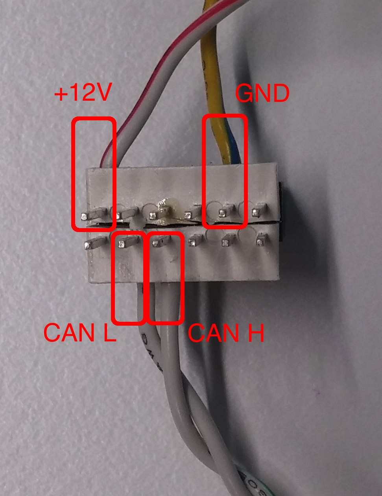

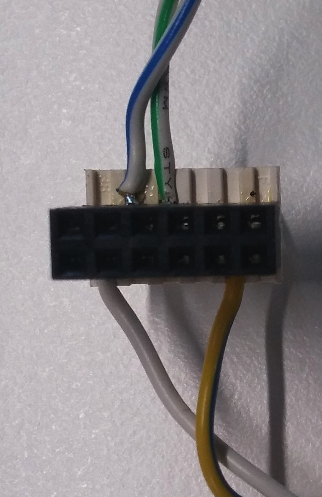

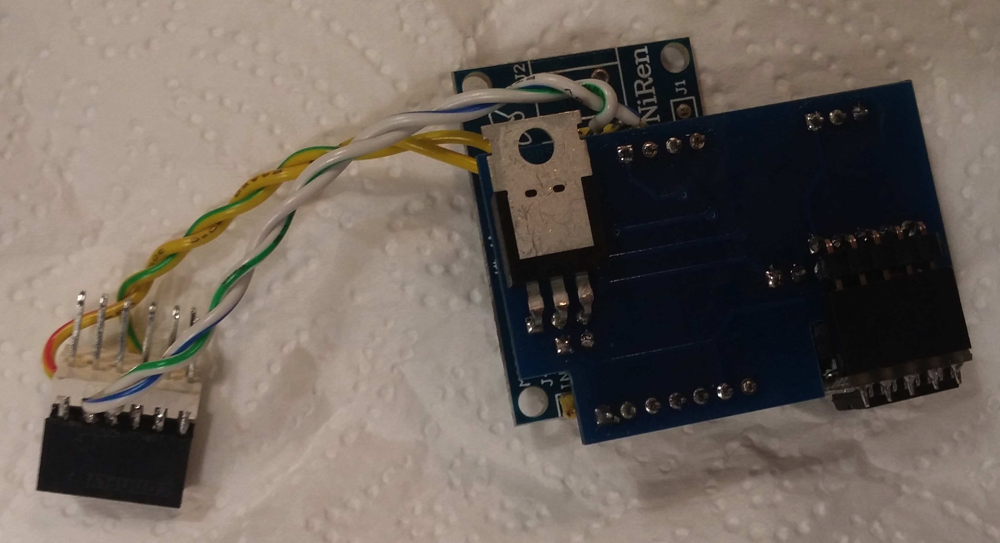

### Plugging into car

There are 2 possible options to mount the module in the car:
- into OBD2 connecttor - which allow easy removal of the modules
- behind FDIM display module - which is more hidden installation

If you do care on your battery current, it's also possible to get power for the module from ACC power line, which powers down the module when vehicle is off and powers it up when it's on and running. This installation option can be done easier when installed behind FDIM display, as additional wires can be hidded inside your dash.

#### Behind FDIM


#### Into OBD

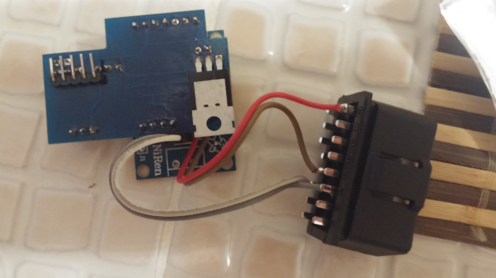

#### With separate ACC power wire

## CAN bus structure

### Ford CAN buses: MS CAN and HS CAN

By design Ford vehicles use two CAN buses - more standard HS CAN (high speed, 500 kbit/s) and Ford-specific MS CAN (medium speed, 125 kbit/s). Newer Fords have even more buses, but since I don't own one - I can't tell anything on this subject.

FDIM display and most of less critical devices resides on MS CAN. It is possible to get access to MS CAN even from standard cheap ELM327 scanner by adding simple switch (modified ELM327 scanners with switch are already available on eBay or AliExpress). For more info refer to [FORScan forum](http://forscan.org/forum/viewtopic.php?f=4&t=4).

On the image below one can see OBD2 socket pinout for MS CAN bus.

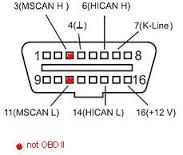

### Messages for FDIM

This section contains brief description of MS CAN messages used for FDIM display control and/or getting basic vehicle telemetry data to display on FDIM. All the information is obtained from open sources or by reverse engineering of MS CAN protocol using vehicles available for the author. No Ford official documentation was used in the process, so exact meaning of message formats may be slightly inaccurate, incomplete or inapplicable for specific vehicle models. Information listed below is used to control FDIM modules on Ford Escapes 2008-2010 and Mercury Mariners 2009-2010, both hybrid and non-hybrid. It is theoretically possible to use those messages on Ford Mustangs 2008-2010, F-150s 2009-2010 and Fiestas 2010.

#### 0x50c - heartbeat

**Description**: Indicates the presence of ACM (Accessory Control Module) or headunit of the vehicle. FDIM display becomes inactive in the absence of the messages.

**Rate**: 10 Hz

**Format**

Header  | Length  | data byte 0  | data byte 1  | data byte 2  | data byte 3  | data byte 4  | data byte 5   | data byte 6  | data byte 7
--|---|---|---|---|---|---|---|---|--
0x50c  | 3  | 0x01  | 0x02  | 0x00  | -  | -  | -  | -  | -

#### 0x3e8 - top line of FDIM module and heartbeat

**Description**: Sets sound source and indicates the presence of ACM (Accessory Control Module) together with 0x50c. FDIM display becomes inactive in the absence of the messages.

**Rate**: 1 Hz

**Format**

Header  | Length  | data byte 0  | data byte 1  | data byte 2  | data byte 3  | data byte 4  | data byte 5   | data byte 6  | data byte 7
--|---|---|---|---|---|---|---|---|--
0x3e8  | 8  | source  | 0x00  | volume  | clock length?  | 0x00  | 0x00  | 0x00  | 0x00

**source** can have the following values:

0x01 - AM

0x02 - FM1

0x03 - FM2

0x04 - PHON

0x05 - SYNC

0x06 - DVD

0x07 - AUX

0x08 - CD

0x09 - EMPTY

0x0A - SAT1

0x0B - SAT2

0x0C - SAT3

0x0D - PHON

0x0E - LINE

0x0F - 2 clocks if no text is printed, or one clock if text is present

**volume** value change displays volume bar

**clock length** have values only 0x00 or 0x04, possibly sets number of digits in current clock display

#### 0x3ef - unknown

**Description**: Unknown. Sent on FDIM initialization and then with rate 1Hz with slightly different data

**Rate**: 1 Hz

**Format**

Header  | Length  | data byte 0  | data byte 1  | data byte 2  | data byte 3  | data byte 4  | data byte 5   | data byte 6  | data byte 7
--|---|---|---|---|---|---|---|---|--
0x3ef  | 8  | 0x32  | 0x32  | 0x32  | 0x32  | 0x03  | 0x00  | 0x00  | init

**init** value is 0x00 on 1st message sent and then 0x20 when module is activated

#### 0x3f2 - clock

**Description**: Current time displayed. Time is given in [binary-coded decimal](https://en.wikipedia.org/wiki/Binary-coded_decimal) format.

**Rate**: 20 Hz. Maybe possible to send less frequently.

**Format**

Header  | Length  | data byte 0  | data byte 1  | data byte 2  | data byte 3  | data byte 4  | data byte 5   | data byte 6  | data byte 7
--|---|---|---|---|---|---|---|---|--
0x3f2  | 8  | hour  | minute  | day  | month  | year  | flags  | 0x00  | 0x00

flags:
0x80 - time is adjusting (blink)
0xA0 - AM
0xC0 - PM
0xE0 - 24 hours
0xC0 - clock off

**Special cases**

**Empty clock**

Header  | Length  | data byte 0  | data byte 1  | data byte 2  | data byte 3  | data byte 4  | data byte 5   | data byte 6  | data byte 7
--|---|---|---|---|---|---|---|---|--
0x3f2  | 8  | 0xFF  | 0xFF  | 0xFF  | 0xFF  | 0xFF  | 0x00  | 0x00  | 0x00

**Examples**

**13:02**

Header  | Length  | data byte 0  | data byte 1  | data byte 2  | data byte 3  | data byte 4  | data byte 5   | data byte 6  | data byte 7
--|---|---|---|---|---|---|---|---|--
0x3f2  | 8  | 0x13  | 0x02  | 0xFF  | 0xFF  | 0xFF  | 0xF0  | 0x00  | 0x00

#### 0x3f1 - unknown

**Description**: Unknown. Sent only once in FDIM start-up message sequence.

**Rate**: Not repeated

**Format**

Header  | Length  | data byte 0  | data byte 1  | data byte 2  | data byte 3  | data byte 4  | data byte 5   | data byte 6  | data byte 7
--|---|---|---|---|---|---|---|---|--
0x3f1  | 8  | 0xF5  | 0x90  | 0x00  | 0x00  | 0x00  | 0x00  | 0x00  | 0x00

#### 0x324 - text message

#### 0x336 - text message

#### 0x337 - text message

#### 0x726 - TPMS request

#### 0x72e - TPMS response

#### 0x3b5 - TPMS broadcast

**Description**: Current tires pressure value given in psi. Present on newer vehicles (possibly 2010+), not present on hybrids. TPMS request-response protocol is more widely used to get tire pressure, but TPMS broadcast is easier to implement. Minimal pressure level is 25 psi, all values below are still shown as 25.

**Rate**: 1 Hz.

**Format**

Header  | Length  | data byte 0  | data byte 1  | data byte 2  | data byte 3  | data byte 4  | data byte 5   | data byte 6  | data byte 7
--|---|---|---|---|---|---|---|---|--
0x3b5  | 8  | front left  | front right  | rear left  | rear right  | 0x00  | 0x00  | 0x00  | 0x00

**Example**

Header  | Length  | data byte 0  | data byte 1  | data byte 2  | data byte 3  | data byte 4  | data byte 5   | data byte 6  | data byte 7
--|---|---|---|---|---|---|---|---|--
0x3b5  | 8  | 0x25  | 0x19  | 0x22  | 0x23  | 0x00  | 0x00  | 0x00  | 0x00

#### 0x423 - Speed, RPM, on/off status

**Description**: Speed in km/h, RPMs and engine temperature. Also indicates when vehicle is in off position.

**Rate**: Varies

**Format**

Header  | Length  | data byte 0  | data byte 1  | data byte 2  | data byte 3  | data byte 4  | data byte 5   | data byte 6  | data byte 7
--|---|---|---|---|---|---|---|---|--
0x423  | 8  | speed1  | speed2  | rpm1  | rpm2  | temperature  | 0x00  | 0x00  | 0x00

Speed (in km/h) = (speed1 * 256 + speed2) / 100 - 100

RPM = rpm1 * 256 + rpm2

**Special cases**

**Vehicle off**

Header  | Length  | data byte 0  | data byte 1  | data byte 2  | data byte 3  | data byte 4  | data byte 5   | data byte 6  | data byte 7
--|---|---|---|---|---|---|---|---|--
0x423  | 8  | 0xFF  | 0xFE  | 0xFF  | 0xFE  | 0xFE  | 0x00  | 0x00  | 0x00

#### 0x466 - GPS time data

**Description**: Current time obtained from GPS satellites, in GMT time zone

**Rate**: 1 Hz

**Format**

Header  | Length  | data byte 0  | data byte 1  | data byte 2  | data byte 3  | data byte 4  | data byte 5   | data byte 6  | data byte 7
--|---|---|---|---|---|---|---|---|--
0x466  | 8  | h  | min  | s  | -  | d  | mon  | y  | 0x00

Hour = ( h >> 3 ) & 0x1F

Minute = ( min >> 2 ) & 0x3F

Second = ( s >> 2 ) & 0x3F

Day = ( d >> 2 ) & 0x3F

Month = ( mon >> 4 ) & 0x0F

Year = ( y >> 3 ) & 0x1F

### Message sequences

#### Initialization

#### Heartbeat

#### Text output

#### TPMS request

## Software

### Source code structure

### Flashing from Arduino IDE

### Flashing from Platform IO/Atom

### Flashing pre-built firmwares

#### On Windows

#### On Mac

#### On Linux

## Configuration

### Serial communication setup

### Options

```
Press any key to enter settings menu... 5

Current settings

Config version: 5
HU type: Aftermarket
Units: Metric
Time source: GPS
Time zone: 3
Clock mode: 24h
Pressure units: Psi
Display pressure: Yes
TPMS interaction mode: Request

FORD FDIM Controller configuration

Select HU type
1 - Aftermarket
2 - Stock
3 - Aftermarket with CAN (simple info)
4 - Aftermarket with CAN (extended info)


> 3
Select time source
1 - 911 Assist GPS (2010+)
2 - controller real time clock


>
2
Current RTC time: 15:24:46

Enter current local time in 24h format (HH:MM) or Enter to keep as is

>


Set clock mode
1 - Hide
2 - 12h
3 - 24h

>
3
Select speed/temperature units
1 - Metric
2 - American


>
1
Display tires pressure
1 - Yes
2 - No


>
1
Pressure units
1 - Psi
2 - kPa
3 - Bars


>
3
Set TPMS interaction mode
1 - Request
2 - Broadcast

>
1
Saving settings...


Settings saved, getting back to operation mode
CAN ok!

```
