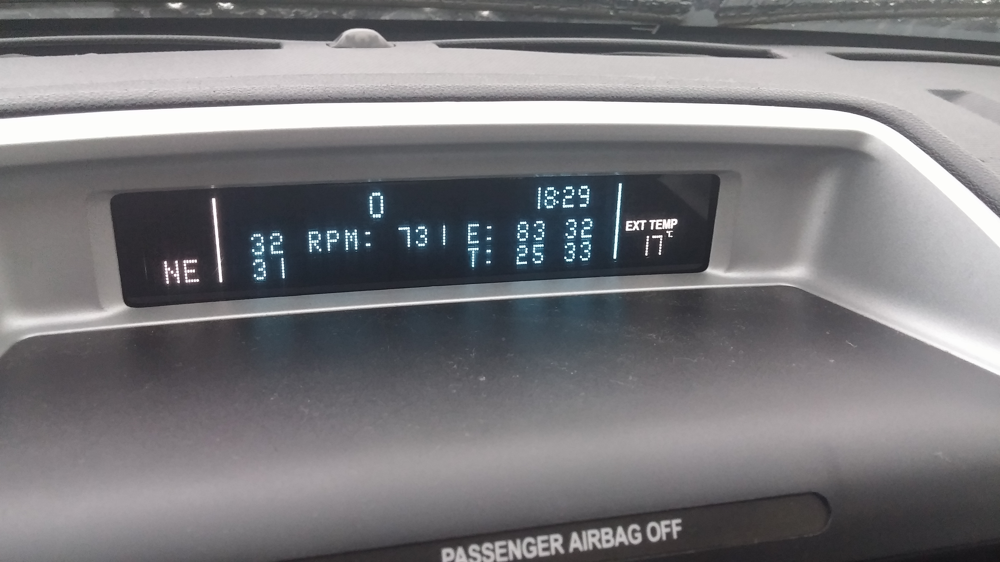
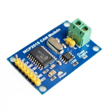
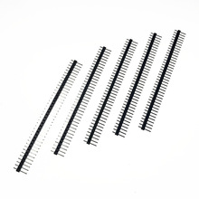
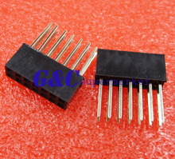
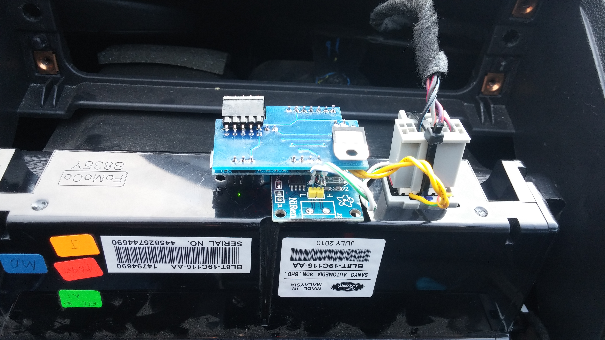

# FoDiMoCo - Ford display module (FDIM) controller

## What's this all about

Long story short. FoDiMoCo is easy-to-build DIY controller for your Ford USA vehicle that
enables top dash display to display some useful information when stock head unit is removed.

When this controller is plugged in, your dash display looks like that



Module itself looks like that (one of hardware variants)


FoDiMoCo is tested on Ford Escapes (including Hybrid) and Mercury Mariners 2008-2012.
Should work on other Fords of the same generation, including Mustang, Fiesta, F-150,
but it's not yet verified due to lack of test vehicles.

FoDiMoCo is built on Arduino and components that could be found on AliExpress and/or your local
DIY electronics store, so it should be easy to reproduce. PCB is available for order at Dirt Cheap PCBs.

If you don't want to read this long text, there are steps you need to build your own FoDiMoCo:

1. [Buy parts](#parts-list)
2. [Order or make PCB](#pcb)
3. [Solder](#soldering-step-by-step)
4. [Flash](#flashing-pre-built-firmwares)
5. [Configure](#configuration)
6. [Plug into the car](#plugging-into-car)

## Overview

### Functionality

- display current speed, RPM, engine temperature, tires pressure, tires temperature, current time
- configurable display units (km/miles for speed, Celsius/Fahrenheit for temperatures, psi/bars/kPa for pressure, 12h/24h for clock)
- full functionality offered with aftermarket head unit (with no other modules using dash display)
- support for CAN-enabled aftermarket head units (may require minor additional power wiring)
- very early preliminary support for stock head units
- semi-configurable display layout for different head unit types
- configuration made on the fly via serial terminal

### Hardware options

- with internal Real Time Clock module
- no internal Real Time Clock (RTC) module, time is taken directly from your vehicle GPS module (model year 2009 and newer with 911 Assist)

### Plugging into your vehicle options

- directly behind your dash display module using DIY pass-through connector
- into vehicle OBD connector

## Hardware

### Parts list
- <details>
    <summary>[Arduino Pro Micro](https://aliexpress.com/wholesale?SearchText=arduino+pro+micro)</summary> <p></p>
  </details>
- <details>
    <summary>[CAN bus controller (MCP 2515 based)]((https://aliexpress.com/wholesale?SearchText=mcp2515+controller))</summary> <p></p>
  </details>
- <details>
    <summary>[RTC clock module (DS 3231 based)](https://aliexpress.com/wholesale?SearchText=ds3231+raspberry)</summary>
    <p></p>
  </details>
- <details>
    <summary>[male pin headers straight (2.54mm pitch)](https://aliexpress.com/wholesale?SearchText=male+pin+headers+straight+2.54)</summary> <p></p>
  </details>
- <details>
    <summary>[male pin headers angled (2.54mm pitch)](https://aliexpress.com/wholesale?SearchText=male+pin+headers+angled+2.54)</summary> <p></p>
  </details>
- <details>
    <summary>PCB (prototype board or order at DirtCheap PCBs)</summary>
    <p>Order details coming soon</p>
  </details>
- <details>
    <summary>(optional) [ELM327 enclosure](https://aliexpress.com/wholesale?SearchText=elm327+case+enclosure)<summary>
    <p></p>
  </details>
- <details>
    <summary>(optional) [long bi-sided pin strips-headers 2x6 (2.54mm pitch), can be cut from 2x7](https://aliexpress.com/wholesale?SearchText=pin+headers+long+2.54+2x6)</summary> <p></p>
  </details>


### Schematics


### PCB


### Soldering step-by-step

### Plugging into car

#### Behind FDIM



#### Into OBD

#### With separate ACC power wire

## CAN bus structure

### Ford CAN buses: MS CAN and HS CAN

### Messages for FDIM

#### 0x50c - heartbeat

#### 0x3e8 - top line of FDIM module

#### 0x3ef

#### 0x3f2 - clock

#### 0x3f1

#### 0x336 - text message

#### 0x324 - text message

#### 0x337 - text message

#### 0x324 - text message

#### 0x726 - TPMS request

#### 0x72e - TPMS response

#### 0x3b5 - TPMS broadcast

#### 0x423 - Speed, RPM, on/off status

#### 0x466 - GPS time data

### Message sequences

#### Initialization

#### Heartbeat

#### Text output

#### TPMS request

## Software

### Source code structure

### Flashing from Arduino IDE

### Flashing from Platform IO/Atom

### Flashing pre-built firmwares

#### On Windows

#### On Mac

#### On Linux

## Configuration

### Serial communication setup

### Options

```
Press any key to enter settings menu... 5

Current settings

Config version: 5
HU type: Aftermarket
Units: Metric
Time source: GPS
Time zone: 3
Clock mode: 24h
Pressure units: Psi
Display pressure: Yes
TPMS interaction mode: Request

FORD FDIM Controller configuration

Select HU type
1 - Aftermarket
2 - Stock
3 - Aftermarket with CAN (simple info)
4 - Aftermarket with CAN (extended info)


> 3
Select time source
1 - 911 Assist GPS (2010+)
2 - controller real time clock


>
2
Current RTC time: 15:24:46

Enter current local time in 24h format (HH:MM) or Enter to keep as is

>


Set clock mode
1 - Hide
2 - 12h
3 - 24h

>
3
Select speed/temperature units
1 - Metric
2 - American


>
1
Display tires pressure
1 - Yes
2 - No


>
1
Pressure units
1 - Psi
2 - kPa
3 - Bars


>
3
Set TPMS interaction mode
1 - Request
2 - Broadcast

>
1
Saving settings...


Settings saved, getting back to operation mode
CAN ok!

```
